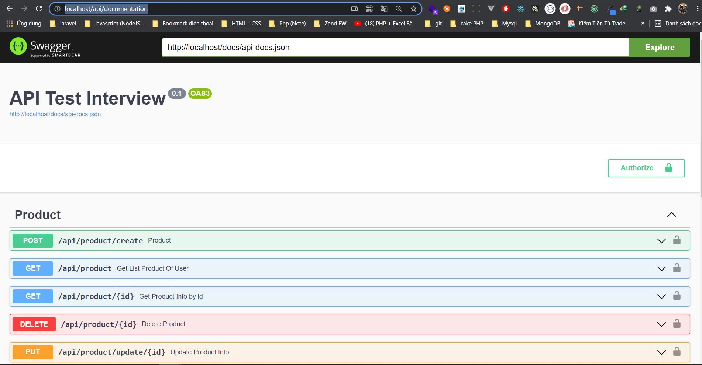

# Document For Run Project API-Interview

## Enviroment and Technology
1. Laravel Framework for API
2. Docker Env for develop
3. Swagger for manage API
4. Apply cron job on docker env


## Installation

1. Clone source with git clone
2. After clone source go to folder with command
```bash
cd  /api_interview
```
3. After go to folder api_interview we exec command
```bash
docker-compose up
```
4. After docker build finish we open browser and enter url
```bash
http://localhost/api/documentation
```
to go to page Swagger management API as below image

